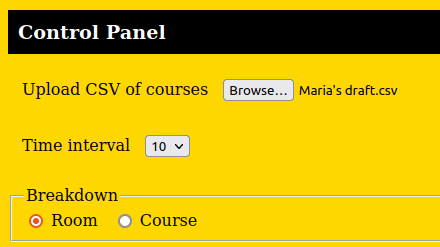
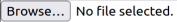
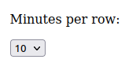
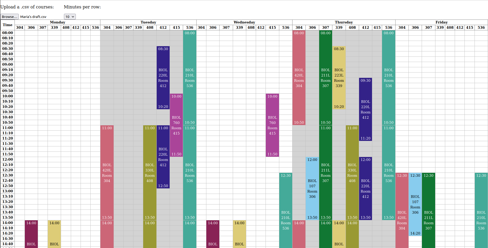

# Classy

Hi Mom!

This is a tool to help you visualize courses and what rooms they're scheduled to occupy.

- [How to get the app](#how-to-get-the-app)
- [How to run the app](#how-to-run-the-app)
- [How to use the app](#how-to-use-the-app)

## How to get the app

1. Click "Code" in the top right.
1. Click "Download ZIP".
1. Unzip the .zip file that you downloaded.
1. You can now open the `index.html` file in the folder you unzipped to use the app (see below).

## How to run the app

Once you have downloaded and unzipped the app somewhere on your machine:

1. In your web browser, go to File > Open File and open `index.html` from the folder of unzipped files (see above).
1. You should see a page that looks something like the following screenshot.

## How to use the app

Once you have the app running in your browser:

1. Save a report from Excel in *UTF-8* `.csv` file format (not Mac or Windows CSV format).
1. You will see an interface to upload a file. Click "Browse..." and select the CSV you saved in step 1.
    1. It should look like this 
1. You should now see a visualization of the schedule broken down by room, something like the screencaps below.
    1. If you don't, call me and I'll fix it!
1. Once you've uploaded a file, you can change the granularity of the rows from e.g. every 5 minutes to every 10 minutes with a dropdown that should look like this: .

### Notes on usage

- You can use Ctrl + P to print the page. Only the course schedule visualization should be printed.
- You don't need to remove columns from the report before saving as a `.csv`.
- If you don't want to see a course, remove its row from your Excel sheet before saving as a `.csv`.
    - *The app will automatically filter out...*:
        - Courses in rooms that are not in building `HH`.
        - Courses with status "Reserved".
        - Courses with no start time, end time, or room number.

## Screencaps

